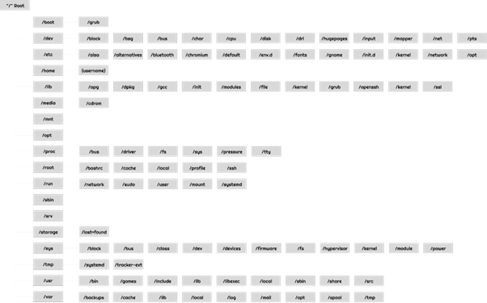
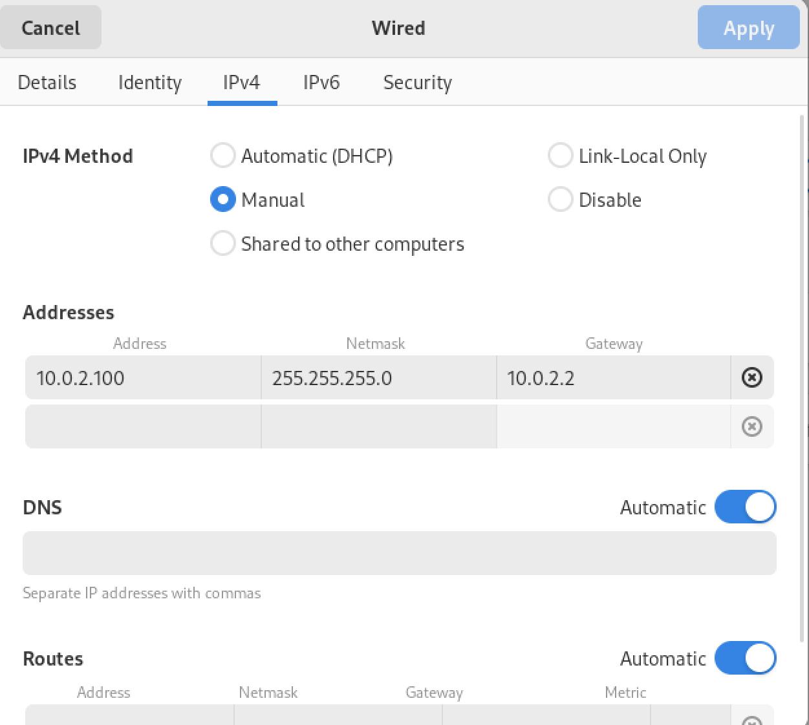

# DAFTAR TUGAS WORKSHOP ADMINISTRASI JARINGAN

| TUGAS | FILE |
| ------| -----|
| TUGAS 1|  [Tugas_Satu](https://github.com/adamrasyid01/SysAdmin-3122500018/blob/main/Tugas1.md) |
| TUGAS 2| [FILE](Tugas_2) , [MARP](Tugas_2/assets/2_Slide_SystemAdministrasi.md)|
| TUGAS 3| [Tugas 3](https://github.com/adamrasyid01/SysAdmin-3122500018/tree/main/Tugas_3#tugas-3)|

# Disusun Oleh

| NAMA | NRP |
| ---- | --- |
| [Zahrotul Hidayah](https://github.com/zah1703)| 3122500004 |
| [Leody Zelvon Herliansa](https://github.com/Leodyz)| 3122500010 |
| [Adam Rasyid Nurmuhammad](https://github.com/adamrasyid01)| 3122500018 |                                   

# TUGAS 2

Berdasarkan Referensi dari [Debian Directory Structure](https://www.debianadmin.com/linux-directory-structure-overview.html)

**DAFTAR ISI**

- [NOMOR 1](#soal-1-struktur-direktori-pada-linux)
- [NOMOR 2](#soal-2-marp-presentation)
- [NOMOR 3](#soal-3-mengubah-ip-address-secara-manual)

# (Soal 1) Struktur Direktori pada Linux

**1. "/” Root**

> Struktur Direktori dimulai dengan sistem file Root “/” dan merupakan direktori root untuk seluruh struktur. Partisi di mana / (direktori root) akan berada pada sistem UNIX atau yang kompatibel dengan UNIX.

**2. /boot**

> Direktori /boot berisi file Boot loader termasuk Grub atau Lilo, Kernel, initrd dan file konfigurasi system.map

**3 ./sys**

>Ini berisi Kernel, Firmware dan file terkait sistem.

**4 ./sbin**

>Berisi Sistem Binari yang penting dan alat Administrasi Sistem yang penting untuk operasi dan kinerja sistem

**5 ./bin**

>Berisi binari penting untuk pengguna dan utilitas yang dibutuhkan dalam mode pengguna tunggal. Contoh, termasuk cat, ls, cp dll.

**6 ./lib**

>Berisi file pustaka untuk semua binari yang ada di direktori /sbin & /bin

**7 ./dev**

>Direktori /dev berisi file sistem dan driver yang penting.

**8 ./etc**

>Direktori /etc berisi file konfigurasi Sistem yang penting termasuk /etc/hosts, /etc/resolv.conf, nsswitch.conf, default dan file konfigurasi jaringan. Ini sebagian besar file konfigurasi sistem dan aplikasi yang spesifik host.

**9 ./home**

>Semua direktori home pengguna disimpan di bawah direktori ini dengan pengecualian direktori home root yang disimpan di bawah direktori /root. Direktori ini menyimpan file pengguna, pengaturan pribadi seperti .profile dll.

**10 ./media**

>Titik kait generik untuk media yang dapat dilepas seperti CD-ROM, USB, Floppy dll

**11 ./mnt**

>Titik kait generik untuk sistem file sementara. Ini berguna terutama ketika pemecahan masalah dari CDROM dll di mana Anda mungkin harus memasang sistem file Root dan mengedit konfigurasi.

**12 ./opt**

>Direktori yang jarang digunakan di Linux untuk Paket Perangkat Lunak Opsional. Ini banyak digunakan di OS UNIX seperti Sun Solaris di mana paket perangkat lunak diinstal

**13 ./usr**

>Sub hirarki ke sistem file root yang merupakan direktori data Pengguna. Berisi utilitas dan aplikasi spesifik pengguna. Anda akan melihat lagi banyak sistem file penting tetapi tidak kritis yang dipasang. Di sini Anda akan menemukan lagi direktori bin, sbin & lib yang berisi binari sistem dan pengguna non-kritis dan pustaka terkait dan direktori share1. Juga ditemukan di sini adalah direktori include dengan file include

**14 ./usr/sbin**

>Berisi binari sistem Non-esensial Non-kritis dan utilitas jaringan

**15 ./usr/bin**

>Berisi binari perintah Non-Esensial Non-kritis untuk pengguna.

**16 ./usr/lib**

>File pustaka untuk binari di direktori /usr/bin & /usr/sbin.

**17 ./usr/share**

>Direktori data bersama yang independen platform

**18 ./usr/local**

>Sub hirarki di bawah direktori /usr yang memiliki data spesifik Sistem Lokal termasuk binari sistem dan pengguna dan pustaka mereka

**19 ./var**

>Direktori /var sebagian besar dipasang sebagai sistem file terpisah di bawah root di mana semua konten variabel seperti log, file spool untuk printer, crontab, pekerjaan at, mail, proses berjalan, file kunci dll. Harus berhati-hati dalam merencanakan sistem file ini dan pemeliharaannya karena ini bisa terisi dengan cepat dan ketika FileSystem penuh dapat menyebabkan masalah operasional sistem dan aplikasi.

**20 ./tmp**

>Sistem file sementara yang menyimpan file sementara yang dibersihkan saat reboot sistem. Ada juga direktori /var/tmp yang menyimpan file sementara juga. satu-satunya perbedaan antara keduanya adalah direktori /var/tmp menyimpan file yang dilindungi saat reboot sistem. Dengan kata lain, file /var/tmp tidak dihapus saat reboot.

## Directory File Linux yang terinstalasi

# (Soal 2) [MARP Presentation](Tugas_2/assets/2_Slide_SystemAdministrasi.md)

## (Soal 3) Mengubah IP Address secara manual

**Langkah Pertama: Cek IP laptop** > dengan $ ipaddr

**Langkah Kedua: Masuk root untuk mengecek rute dari IP**

**Langkah Ketiga: Cek dhcp Client**

**Langkah Keempat:Cek untuk browser sebelum diset Ip nya secara manual**

**Langkah Kelima: Pergi ke Wired Setting**

**Langkah Keenam: Setting IPv4 secara manual**

Selesai
